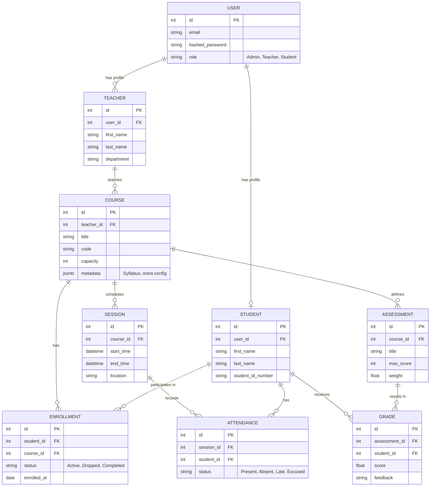

# Phase 1: Core Design & Schema

This document outlines the core architecture, data models, access controls, and database strategies for G-TEK Open Campus.

## 1. Entity-Relationship (ER) Diagram

The following Mermaid diagram maps out the relationships between Students, Courses, Enrollments, Sessions, Attendance, Assessments, and Grades.

## 2. Role-Based Access Control (RBAC) Matrix

| Resource          | Admin                 | Teacher                            | Student                            |
|-------------------|-----------------------|------------------------------------|------------------------------------|
| **Users**         | Full CRUD             | Read-only (Students)               | Read/Update self                   |
| **Courses**       | Full CRUD             | CRUD (Owned courses)               | Read-only                          |
| **Enrollments**   | Full CRUD             | Read-only (Owned courses)          | Read-only (Own enrollments)        |
| **Sessions**      | Full CRUD             | CRUD (Owned courses)               | Read-only (Enrolled courses)       |
| **Attendance**    | Full CRUD             | CRUD (Owned courses)               | Read-only (Own attendance)         |
| **Assessments**   | Full CRUD             | CRUD (Owned courses)               | Read-only (Enrolled courses)       |
| **Grades**        | Full CRUD             | CRUD (Owned courses)               | Read-only (Own grades)             |

## 3. PostgreSQL Advanced Features Plan

To support the Odoo-style modularity and high performance at scale, we will leverage the following Postgres features:

- **JSONB Columns:** 
  - Used in `Course` for custom dynamic fields (e.g., specific prerequisites, lab requirements) without needing schema migrations.
  - Used in `User` or `Student` for flexible profile attributes.
- **Table Partitioning:**
  - `Attendance` records grow very fast (Students × Sessions). We will implement **List Partitioning by Academic Year** or **Range Partitioning by Date** to ensure query speeds remain fast during bulk attendance imports.
- **Materialized Views:**
  - Will be used to calculate running aggregations like **Student GPA** or **Course Grade Distributions**. These will be refreshed concurrently on a schedule or via triggers to avoid heavy calculation on API reads.

## 4. API Contract & OpenAPI Strategy

Rather than manually writing a YAML OpenAPI spec, FastAPI will auto-generate it. Our contract strategy:

1. **Auth:** `POST /api/v1/auth/login` (Returns JWT)
2. **Students:** `GET /api/v1/students/me`, `GET /api/v1/students`
3. **Courses:** `GET /api/v1/courses`, `POST /api/v1/courses/{id}/enroll`
4. **Attendance:** `POST /api/v1/sessions/{id}/attendance/bulk` (Accepts list of student statuses)
5. **Grades:** `GET /api/v1/students/{id}/transcript`

*All endpoints will use Pydantic V2 schemas for strict I/O validation and automatic documentation generation.*

